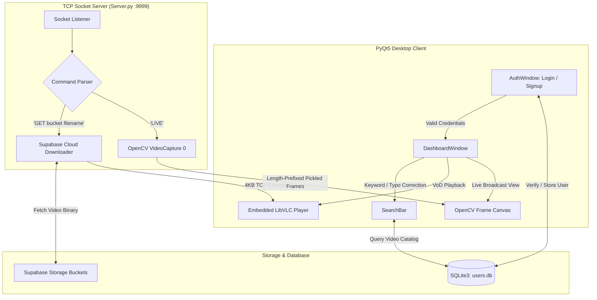

<div align="center">

# 🎬 SocketStream: Client-Server Video Streaming & Live Broadcast

[](https://www.python.org/)
[](https://pypi.org/project/PyQt5/)
[](https://opencv.org/)
[](https://www.videolan.org/vlc/)
[](https://supabase.com/)
[](https://www.sqlite.org/)

A multi-threaded, desktop-based Video Streaming and Video-on-Demand (VoD) application built with **Python TCP Sockets**, **PyQt5**, **OpenCV**, and **LibVLC**. Supports cloud-backed video streaming from **Supabase Storage** and real-time live webcam broadcasting.

</div>

---

## 📑 Table of Contents
- [Key Features](#-key-features)
- [Architecture & System Design](#-architecture--system-design)
- [Tech Stack](#-tech-stack)
- [Prerequisites](#-prerequisites)
- [Installation & Setup](#-installation--setup)
- [How to Run](#-how-to-run)
- [Socket Protocol Specifications](#-socket-protocol-specifications)
- [Directory Structure](#-directory-structure)
- [Troubleshooting](#-troubleshooting)

---

## ✨ Key Features

- **📡 Dual Streaming Modes**:
  - **Video-on-Demand (VoD)**: Streams multi-category MP4 videos stored in Supabase cloud buckets directly to an embedded VLC player over TCP socket chunks.
  - **Live Camera Streaming**: Captures real-time webcam frames using OpenCV, serializes them over TCP sockets with length-prefixed headers, and renders them dynamically.
- **🔍 Smart Fuzzy Search**:
  - Built-in typo auto-correction powered by Python's `difflib.get_close_matches`.
  - Contextual keyword-to-category mapping (e.g., searching `"virat"` or `"match"` automatically queries the `cricket` bucket; `"pubg"` queries `games`).
- **🎛️ Modern Desktop UI (PyQt5)**:
  - Nord dark-themed authentication and dashboard windows.
  - Dedicated video controls: **Play**, **Pause**, **Stop**, **Zoom In (+10%)**, **Zoom Out (-10%)**, and a borderless **Full-Screen** theater mode.
- **🔐 User Authentication & Local Metadata**:
  - Secure registration and login flows with regex validation for proper email formats and strong passwords (8+ chars, uppercase, digits, symbols).
  - Local **SQLite3** database (`users.db`) managing user credentials and video catalog indexing.

---

## 🏗️ Architecture & System Design



---

## 🛠️ Tech Stack

| Technology | Purpose |
| :--- | :--- |
| **[Python 3.10+](https://www.python.org/)** | Core programming language |
| **TCP Sockets (`socket`, `struct`, `pickle`)** | Custom network transport protocol and binary data framing |
| **[PyQt5](https://riverbankcomputing.com/software/pyqt/)** | Graphical user interface, custom themes, and event handling |
| **[OpenCV (`cv2`)](https://opencv.org/)** | Camera device capture and image matrix processing |
| **[python-vlc](https://wiki.videolan.org/Python_bindings)** | Hardware-accelerated media decoding and native playback |
| **[Supabase](https://supabase.com/)** | Cloud object storage for hosting VoD media files |
| **SQLite3** | Local relational storage for authentication and video metadata |

---

## 📋 Prerequisites

Before running the project, make sure you have:

1. **Python 3.10 or higher** installed and added to your system `PATH`.
2. **VLC Media Player (64-bit)**:
   - `python-vlc` requires the native `libvlc.dll` (Windows) or `libvlc.so` (Linux).
   - Download the **64-bit** installer from [VideoLAN](https://www.videolan.org/vlc/).
3. **A working Webcam**: Required for testing the live camera streaming feature.

---

## 🚀 Installation & Setup

### 1. Clone the Repository
```bash
git clone https://github.com/AmitPundekar16/vide-streaming-server.git
cd vide-streaming-server
```

### 2. Set Up a Virtual Environment (Recommended)
```bash
# Windows
python -m venv venv
.\venv\Scripts\activate

# Linux / macOS
python3 -m venv venv
source venv/bin/activate
```

### 3. Install Dependencies
```bash
pip install -r Requirements.txt
```

### 4. Configure Supabase Credentials
Create or edit `Apikeys.py` in the root directory and provide your Supabase project credentials:
```python
SUPABASE_URL = "https://your-project.supabase.co"
SUPABASE_KEY = "your-anon-or-service-key"
```

---

## 💻 How to Run

Because this is a socket-based client-server system, you must run the server and client in **two separate terminal windows**:

### Step 1: Start the Server (Terminal 1)
```powershell
python Server.py
```
> **Output:**
> ```text
> Starting combined server...
> Server running at 0.0.0.0:9999
> Waiting for clients...
> ```

### Step 2: Launch the Client (Terminal 2)
```powershell
python Client.py
```
1. **Sign Up / Login**: Enter your credentials. Passwords require at least 8 characters, 1 uppercase letter, 1 number, and 1 special symbol.
2. **Search Videos**: Type a topic or category in the search bar (e.g., `cricket`, `movies`, `music`, `virat`, `pubg`, `animals`) and hit **Enter**.
3. **Play Video**: Select any video title from the sidebar playlist to stream it from the server.
4. **Live Stream**: Click the **🔴 Live Stream** button to launch the real-time webcam feed.

---

## 📡 Socket Protocol Specifications

The server communicates via TCP socket on port `9999`:

### 1. Live Streaming (`LIVE`)
- **Client Request**: Sends `LIVE` (ASCII encoded).
- **Server Transmission**: Captures webcam frames, serializes using `pickle`, packs the payload size using an 8-byte unsigned long-long (`struct.pack("Q", len(frame_data))`), and sends:
  ```
  [ 8-byte frame length ][ Pickled OpenCV Frame Data ]
  ```

### 2. Video-on-Demand (`GET <bucket> <filename>`)
- **Client Request**: Sends `GET <bucket_name> <file_name>`.
- **Server Transmission**: Downloads the file from Supabase, transmits the total size formatted as a 16-byte left-aligned string, followed by the video stream in 4096-byte chunks:
  ```
  [ 16-byte Total File Size ][ 4096-byte Chunk 1 ][ 4096-byte Chunk 2 ] ...
  ```

---

## 📂 Directory Structure

```text
Video_Streaming_Server_Sockets/
├── Assets/                    # Application icons, graphics, animations
├── Database/
│   ├── Sqlite_db.py           # SQLite schema definitions & user/video queries
│   └── users.db               # SQLite database file
├── Ui/
│   ├── Dashboard.py           # Main player dashboard & fullscreen viewer
│   ├── Login.py               # Authentication and login window
│   ├── Searchbar.py           # Fuzzy search with keyword autocorrect
│   ├── Signup.py              # User registration window
│   └── Video_Player.py        # Video player component
├── Apikeys.py                 # Supabase configuration (gitignored)
├── Client.py                  # Client entry point
├── Server.py                  # Multi-threaded TCP socket server
├── livestream.py              # Standalone live stream prototype
├── Requirements.txt           # Python package dependencies
├── .gitignore                 # Files excluded from git
└── README.md                  # Project documentation
```

---

## ❓ Troubleshooting

- **`No Python at '...'` or Venv error**:
  - Open `pyvenv.cfg` in your virtual environment folder and ensure `home` and `executable` point to your active Python installation.
- **`VLC could not be found` or `NameError: vlc`**:
  - Ensure the **64-bit** version of VLC Media Player is installed. 32-bit VLC will fail to load with a 64-bit Python interpreter.
- **Camera not opening during live stream**:
  - Ensure other applications (Zoom, Teams, Discord) are not currently using your webcam.
- **Socket connection refused**:
  - Verify that `Server.py` is running before launching `Client.py`.

---

<div align="center">
Made with ❤️ using Python, Sockets, and PyQt5
</div>

